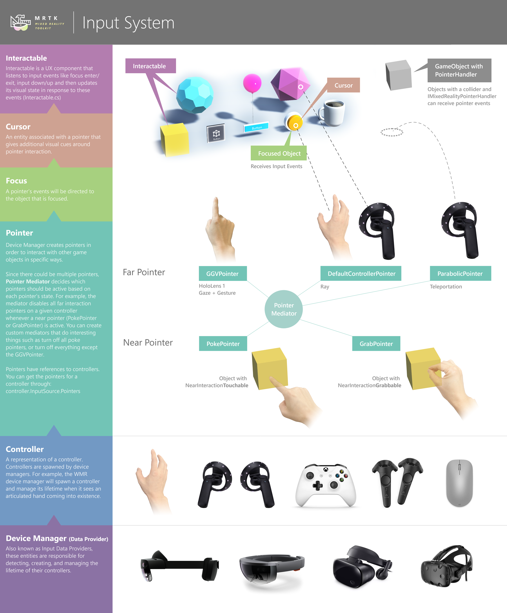

# Input System

The input system is one of the largest systems out of all the features offered by the MRTK.
So many things within the toolkit build on top of it (pointers, focus, prefabs). The code within the input
system is what allows for the natural interactions like grab and rotate.

The input system has some of its own terminology that are worth defining:

- **Data Providers**

    The input settings in the input profile have references to entities known as "data providers" - another word
    that describes these are “device managers”. These are components whose job is to extend the MRTK input system
    by interfacing with a specific underlying system. An example of a provider is the Windows Mixed Reality provider,
    whose job it is to talk with the underlying Windows Mixed Reality APIs, and then translate the data from
    those APIs into MRTK-specific input concepts below. Another example would be the OpenVR provider (who job it
    is to talk to Unity-abstracted version of OpenVR APIs and then translate that data into MRTK input concepts).

- **Controller**

    A representation of a physical controller (whether it’s a 6-degree-of-freedom controller, a HoloLens 1-style
    hand with gesture support, a fully articulated hand, a leap motion controller, etc.). Controllers are spawned
    by device managers (i.e. the WMR device manager will spawn a controller and manage its lifetime when it sees an
    articulated hand coming into existence, for example).

- **Pointer**

    In order to interact with the rest of the world, a controller is associated with pointers, which can interact with
    other game objects in specific ways. For example, the near interaction pointer is responsible to detecting when
    your hand (which is a controller) is close to objects that advertise themselves as supporting ‘near interaction’.
    There are pointers that handle teleportation. There are far pointers (i.e. the shell hand ray pointer) that uses
    far raycasts to engage with content that is longer than arms length from the user.

    Note that a controller can be associated with many different pointers at the same time – in order to ensure that
    this doesn’t devolve into chaos, there is also a pointer mediator which controls which pointers are allowed to be
    active (for example, this will disable far interaction pointers when near interaction is detected).

- **Focus**

    A pointer’s events will be directed to the object that is focused. For example, this can be the object that is
    raycast from the shell hand ray pointer, or this could be the object that is closest in a sphere raycast away from
    the index finger tip. Focus is a particularly important concept because it controls where input events are
    delivered (i.e. where IMixedRealityPointerHandler, IMixedRealityFocusHandler, and other input events are delivered)
    Focus is especially interesting because it drives the object that gets input events, so instead of every single
    object needing to register globally for input events and then filter them out, focus helps narrow down the set of
    things that are poked to respond to input. Note that it's still possible to register for global input events,
    though that event stream is typically very noisy.

- **Cursor** 

    An entity associated with a pointer that gives additional visual cues around pointer interaction. For example,
    the FingerCursor will render a ring around your finger, and may rotate that ring when your finger is close to
    ‘near interactable’ objects. A pointer can be associated with a single cursor at time.

- **Interactable/Manipulation**

    Objects can be tagged with an interaction or manipulation script (this may be Interactable.cs, or something like
    NearInteractionGrabbable.cs). This allows for certain pointers (especially near interaction pointers) to know
    which objects can be focused on (i.e. this could allow a near interaction pointer to know that a particular
    object is grabbable, so during the ‘what has focus’ update loop, this pointer could spherecast and discover
    the grabbable object, and thus any grab gesture will be then forwarded onto that object).

The image below captures the high level build up (from bottom up) of the MRTK input stack:

