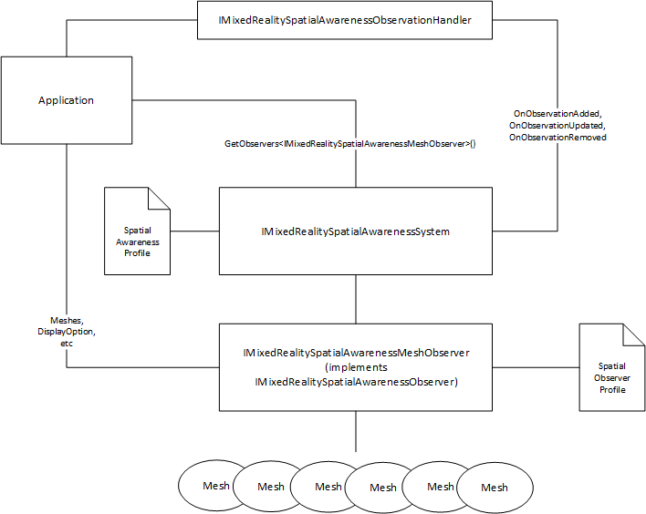

# Spatial Awareness

The spatial awareness system provides support for visualizing and reasoning over mapping data of the real
world. It provides:

1. Notifications for when meshes have been generated (and a way to get those meshes).
2. A mechanism to stop/start observation (i.e. to allow for runtime disabling of mesh visualization and generation).
3. Mesh visualization.

This system only works on platforms that support spatial mapping. Currently MRTK provides inbox support
for spatial mapping on the following platforms:

- HoloLens 1
- HoloLens 2

On platforms that don't support spatial features, this system will fallback gracefully to null/empty
collections, no events, etc.

## Architecture diagram

## Breakdown

The spatial awareness system is composed of multiple parts, which together work to read in and then
expose and render underlying spatial data.

### System

Similar to the [input system](InputSystem/Terminology.md), at the root of the spatial awareness system
is an object that is responsible for initializing and running the spatial work. It does so by creating
and then running its list of spatial observers (which are also referred to as data providers in).

### Observers

A spatial observer is responsible for interfacing with a specific underlying system (for example, the
inbox MRTK spatial observer talks with the Windows Mixed Reality platform to get HoloLens meshes) and
then surfacing the platform specific data in a way that is consistent with the larger spatial awareness
system.

## Usage

For more details on the usage of this system, refer to the
[feature overview](../SpatialAwareness/SpatialAwarenessGettingStarted.md) and the
[usage guide](../SpatialAwareness/UsageGuide.md)