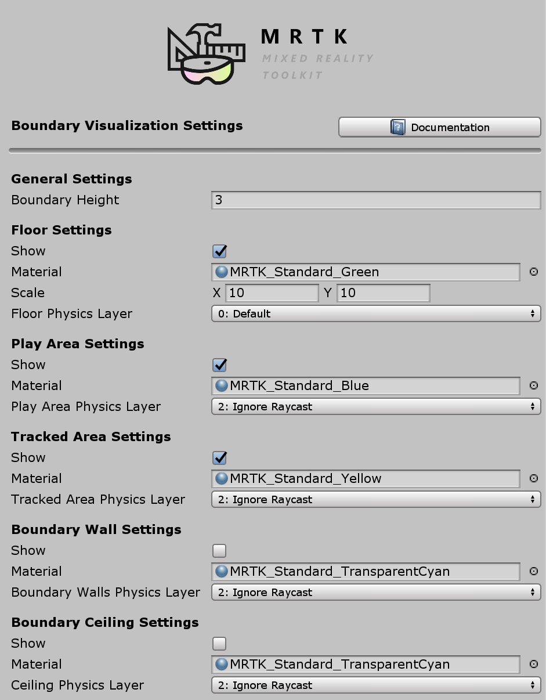

# Boundary System

The Boundary system provides support for visualizing Virtual Reality boundary components in
mixed reality applications. Boundaries define the area in which users can move around 
while wearing a VR headset.

Boundaries are an important component of a mixed reality experience to help users avoid unseen 
obstacles while wearing a VR headset.

Many Virtual Reality platforms provide an automatic display, for example a white outline 
superimposed on the virtual world as the user or their controller nears the boundary. The
Mixed Reality Toolkit's boundary system extends this feature to enable the display of an 
outline of the tracked area, a floor plane and other features that can be used to provide
additional information to users. 

## Getting Started

Adding support for boundaries requires two key components of the Mixed Reality Toolkit: the 
boundary system and a Virtual Reality platform configured with a boundary.

1. [Enable](#enable-boundary-system) the boundary system
2. [Configure](#configure-boundary-visualization) the boundary visualization
3. [Build and deploy](#build-and-deploy) to a VR platform with a configured boundary

## Enable Boundary System

The boundary system is managed by the MixedRealityToolkit object (or another [service registrar](xref:Microsoft.MixedReality.Toolkit.IMixedRealityServiceRegistrar) component).

The following steps presume use of the MixedRealityToolkit object. Steps required for other service registrars may be different.

1. Select the MixedRealityToolkit object in the scene hierarchy.

1. Navigate the Inspector panel to the Boundary System section and check Enable

1. Select the Boundary System implementation

> [!NOTE]
> Users of the default profile (DefaultMixedRealityToolkitConfigurationProfile) will have the boundary system pre-configured to use the MixedRealityBoundarySystem from the Mixed Reality Toolkit Boundary System Service package.

## Configure Boundary Visualization

The boundary system uses a configuration profile to specify which boundary components are to be displayed and to configure their appearance. Please see [Configuring the Boundary Visualization](ConfiguringBoundaryVisualization.md) for more information pertaining to the available visualization options.

> [!NOTE]
> Users of the default profile (DefaultMixedRealitBoundarySystemProfile) will have the boundary system pre-configured to display a floor plane, the play area and the tracked area.

## Build and Deploy

Once the boundary system is configured with the desired visualization options, the project can be built deployed to the target platform.

> [!NOTE]
> Using Play Mode, in Unity, enables in editor visualization of the configured boundary. This feature enables rapid development and testing without requiring the build and deploy step. Be sure to do final acceptance testing using an built and deployed version of the application, running on the target hardware and platform.

## See Also

- [Boundary API documentation](xref:Microsoft.MixedReality.Toolkit.Boundary)
- [Configuring the Boundary Visualization](ConfiguringBoundaryVisualization.md)
