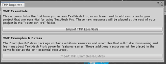
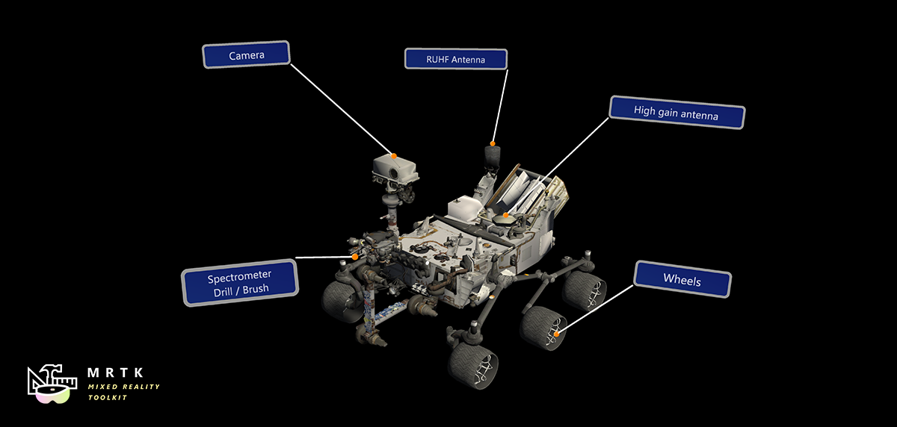
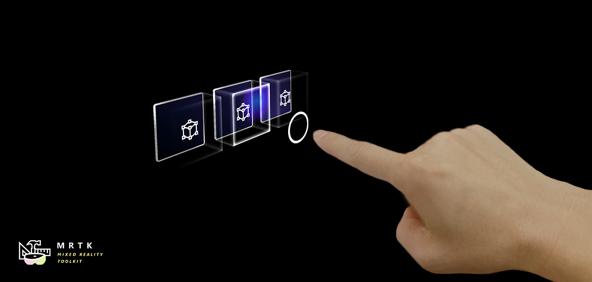
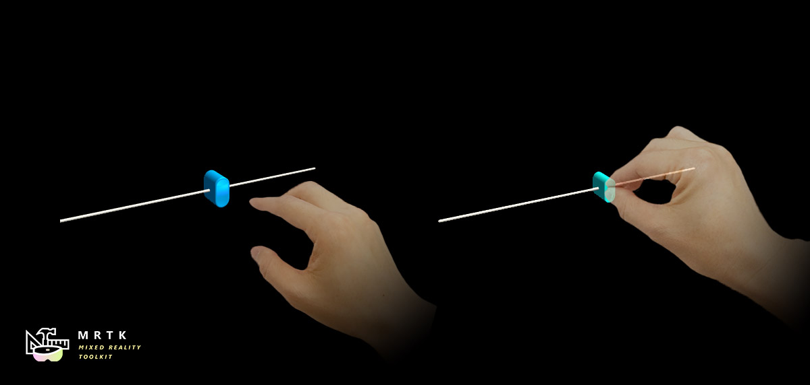
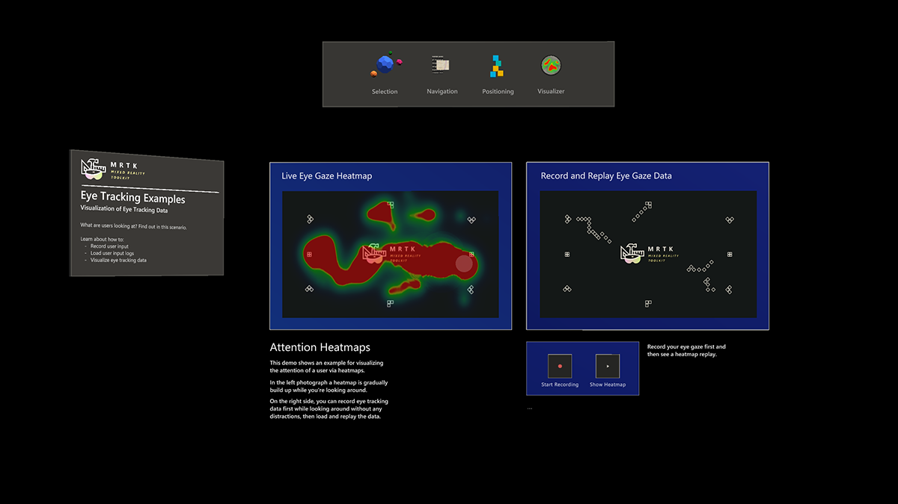

# Getting Started with MRTK

The Mixed Reality Toolkit (MRTK) is a cross-platform toolkit for building Mixed Reality experiences for Virtual Reality (VR) and Augmented Reality (AR).

## Prerequisites

To get started with the Mixed Reality Toolkit you will need:

* [Visual Studio 2019](https://visualstudio.microsoft.com/downloads/)
* [Unity 2018.4.x, 2019.1.x or 2019.2.x](https://unity3d.com/get-unity/download/archive)

  MRTK supports both IL2CPP and .NET scripting backends on Unity 2018

* [Latest MRTK release](https://github.com/Microsoft/MixedRealityToolkit-Unity/releases)
* [Windows SDK 18362+](https://developer.microsoft.com/en-US/windows/downloads/windows-10-sdk).

  This is necessary if you are building a UWP app for WMR, HoloLens 1, or HoloLens 2. This is not necessary
  when building for OpenVR.

## Getting started tutorials

If you are new to MRTK, or MR development, we recommend you check out the [Getting started tutorials](https://docs.microsoft.com/en-us/windows/mixed-reality/mrlearning-base) which uses MRTK v2.

## Add MRTK to your Unity Project

### Get the latest MRTK Unity packages

1. Go to the  [MRTK release page](https://github.com/Microsoft/MixedRealityToolkit-Unity/releases).
1. Under Assets, download
    - `Microsoft.MixedRealityToolkit.Unity.Foundation.unitypackage`
    - `Microsoft.MixedRealityToolkit.Unity.Extensions.unitypackage`
    - `Microsoft.MixedRealityToolkit.Unity.Tools.unitypackage`
    - `Microsoft.MixedRealityToolkit.Unity.Examples.unitypackage`

For additional delivery mechanisms, please see [Downloading the MRTK](DownloadingTheMRTK.md).

### Switch your Unity project to the target platform

The next step **Import MRTK packages into your Unity project** will apply changes to your project specifically for the platform that is selected in the project at that moment you import them.

You should make sure that you select the correct platform before following the next step.

For instance, if you want to create a HoloLens application, switch to Universal Windows Platform:

- Open menu : File > Build Settings
- Select **Universal Windows Platform** in the **Platform** list
- Click on the **Switch Platform** button

### Import MRTK packages into your Unity project

1. Create a new Unity project, or open an existing project. When creating a project, make sure to select "3D" as the template type.
1. Import the `Microsoft.MixedRealityToolkit.Unity.Foundation.unitypackage` you downloaded by going into "Asset -> Import Package -> Custom Package", selecting the .unitypackage file, ensure all items to import are checked, and then selecting "Import".
1. Import the `Microsoft.MixedRealityToolkit.Unity.Examples.unitypackage` following the same steps as above. The examples package is optional and contains useful demonstration scenes for current MRTK features.
1. Import the `Microsoft.MixedRealityToolkit.Unity.Tools.unitypackage` following the same steps as for the foundation package. These tools package is optional and contains useful tools, such as the ExtensionServiceCreator, that enhance the MRTK developer experience.
1. Import the `Microsoft.MixedRealityToolkit.Unity.Extensions.unitypackage` following the same steps as for the foundation package. The extensions package provides a set of useful optional components for the MRTK.

After importing the Foundation package, you may see a setup prompt like the following:

MRTK is attempting to set up your project for building Mixed Reality solutions by doing the following:

 * Enable XR Settings for your current platform (enabling the XR checkbox).
 * Force Text Serialization / Visible Meta files (recommended for Unity projects using source control).

Accepting these options is completely optional, but recommended.

Some prefabs and assets require TextMesh Pro, meaning you have to have the TextMesh Pro package installed and the assets in your project (Window -> TextMeshPro -> Import TMP Essential Resources). **After you import TMP Essentials Resources, you need to restart Unity to see changes**.

### Open and run the HandInteractionExamples scene in editor

The [hand interaction examples scene](README_HandInteractionExamples.md) is a great place to get started because it shows a wide variety of UX controls and interactions in MRTK. To get started we will import MRTK, open the example scene, and explore the scene in the editor.

1. Create a new Unity project and then import both the **Foundation** and **Examples** unity packages following [the steps above](#import-mrtk-packages-into-your-unity-project).
2. Open the HandInteractionExamples scene under `Assets\MixedRealityToolkit.Examples\Demos\HandTracking\Scenes\HandInteractionExamples`

3. You may get a prompt asking you to import "TMP Essentials".

If you get such a prompt, select "Import TMP essentials" button. "TMP Essentials" refers to Text Mesh Pro plugin, which some of the MRTK examples use for improved text rendering. (See [Text in Unity](https://docs.microsoft.com/en-us/windows/mixed-reality/text-in-unity) for more detailed information)

4. Close the TMP dialog. After this you need to reload the scene. You can do this by opening other example scene and open HandInteractionExamples scene again.

5. Press the play button.

Have fun exploring the scene! You can use simulated hands to interact in editor. You can:

- Press WASD keys to fly / move.
- Press and hold right mouse to look around.
- Press and hold space bar to use a simulated hand.

There's quite a bit to explore here. You can learn more about the UI controls [in the hand interaction examples guide](README_HandInteractionExamples.md). Also, read through [input simulation docs](InputSimulation/InputSimulationService.md) to learn more about in-editor hand input simulation in MRTK.

Congratulations, you just used your first MRTK scene. Now onto creating your own experiences...

### Add MRTK to a new scene or new project

1. Create a new Unity project, or start a new scene in your current project. 

2. Make sure you have imported the MRTK packages (we recommend both Foundation and Examples, though Examples is not required) following [the steps above](#import-mrtk-packages-into-your-unity-project).

3. From the menu bar, select Mixed Reality Toolkit -> Add to Scene and Configure

4. You will see a prompt like this:

Click "OK".

5. You will then be prompted to choose an MRTK Configuration profile. Double click "DefaultMixedRealityToolkitConfigurationProfile".

> **NOTE**: Note that if you are getting started on the HoloLens 2, you should choose the "DefaultHoloLens2ConfigurationProfile" instead.
> See the [profiles](Profiles/Profiles.md#hololens-2-profile) for more information on the differences between 
> DefaultMixedRealityToolkitConfigurationProfile and DefaultHoloLens2ConfigurationProfile.

You will then see the following in your Scene hierarchy:

Which contains the following:

* Mixed Reality Toolkit - The toolkit itself, providing the central configuration entry point for the entire framework.
* MixedRealityPlayspace - The parent object for the headset, which ensures the headset / controllers and other required systems are managed correctly in the scene.
* The Main Camera is moved as a child to the Playspace - Which allows the playspace to manage the camera in conjunction with the SDKs

**Note** While working in your scene, **DO NOT move the Main Camera** (or the playspace) from the scene origin (0,0,0).  This is controlled by the MRTK and the active SDK.
If you need to move the players start point, then **move the scene content and NOT the camera**!

6. Hit play and test out hand simulation by pressing spacebar.

You are now ready to start building your project!

## Recommended build settings (UWP)

When building for WMR, HoloLens 1, or HoloLens 2, it is recommended that your build settings "Target SDK Version"
and "Minimum Platform Version" look like they do in the picture below:

The other settings can be different (for example, Build Configuration/Architecture/Build Type and others can always
be changed inside the Visual Studio solution).

Make sure that you click on "Target SDK Version" and that it has the option "10.0.18362.0" - if this is missing,
it means you have to install [the latest Windows SDK](https://developer.microsoft.com/en-us/windows/downloads/windows-10-sdk).

## Next steps

Here are some suggested next steps:

* Add a [PressableButton](README_Button.md) to your scene (we recommend using the `PressableButtonPlated` prefab to start)).
* Add a cube to your scene, then make it movable using the [ManipulationHandler](README_ManipulationHandler.md) component.
* Learn about the UX controls available in MRTK in [building blocks for UI and interactions](#building-blocks-for-ui-and-interactions).
* Read through [input simulation guide](InputSimulation/InputSimulationService.md) to learn how to simulate hand input in editor.
* Learn how to work with the MRTK Configuration profile in the [mixed reality configuration guide](MixedRealityConfigurationGuide.md).

## Building blocks for UI and interactions

|   [Button](README_Button.md) |  [Bounding Box](README_BoundingBox.md) |  [Manipulation Handler](README_ManipulationHandler.md) |
|:--- | :--- | :--- |
| A button control which supports various input methods including HoloLens 2's articulated hand | Standard UI for manipulating objects in 3D space | Script for manipulating objects with one or two hands |
|   [Slate](README_Slate.md) |  [System Keyboard](README_SystemKeyboard.md) |  [Interactable](README_Interactable.md) |
| 2D style plane which supports scrolling with articulated hand input | Example script of using the system keyboard in Unity  | A script for making objects interactable with visual states and theme support |
|   [Solver](README_Solver.md) |  [Object Collection](README_ObjectCollection.md) |  [Tooltip](README_Tooltip.md) |
| Various object positioning behaviors such as tag-along, body-lock, constant view size and surface magnetism | Script for lay out an array of objects in a three-dimensional shape | Annotation UI with flexible anchor/pivot system which can be used for labeling motion controllers and object. |
|   [App Bar](README_AppBar.md) |  [Pointers](/Input/Pointers.md) |  [Fingertip Visualization](README_FingertipVisualization.md) |
| UI for Bounding Box's manual activation | Learn about various types of pointers | Visual affordance on the fingertip which improves the confidence for the direct interaction |
|   [Slider](README_Sliders.md) |  [MRTK Standard Shader](README_MRTKStandardShader.md) |  [Hand Joint Chaser](README_HandJointChaser.md) |
| Slider UI for adjusting values supporting direct hand tracking interaction | MRTK's standard shader supports various fluent design elements with performance | Demonstrates how to use solver to attach objects to the hand joints |
|   [Eye Tracking: Target Selection](EyeTracking/EyeTracking_TargetSelection.md) |  [Eye Tracking: Navigation](EyeTracking/EyeTracking_Navigation.md) |  [Eye Tracking: Heat Map](EyeTracking/EyeTracking_ExamplesOverview.md#visualization-of-visual-attention) |
| Combine eyes, voice and hand input to quickly and effortlessly select holograms across your scene | Learn how to auto scroll text or fluently zoom into focused content based on what you are looking at| Examples for logging, loading and visualizing what users have been looking at in your app |

## Tools
|   [Optimize Window](Tools/OptimizeWindow.md) |  [Dependency Window](Tools/DependencyWindow.md) |  Build Window |  [Input recording](InputSimulation/InputAnimationRecording.md) |

| :--- | :--- | :--- | :--- |
| Automate configuration of Mixed Reality projects for performance optimizations | Analyze dependencies between assets and identify unused assets |  Configure and execute end-to-end build process for Mixed Reality applications | Record and playback head movement and hand tracking data in-editor |

## Upgrading from the HoloToolkit (HTK/MRTK v1)

There is not a direct upgrade path from the HoloToolkit to Mixed Reality Toolkit v2 due to the rebuilt framework. However, it is possible to import the MRTK into your HoloToolkit project and migrate your implementation. For more information please see the [HoloToolkit to Mixed Reality Toolkit Porting Guide](HTKToMRTKPortingGuide.md)
