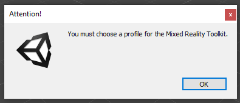
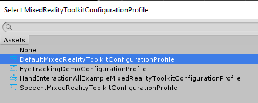
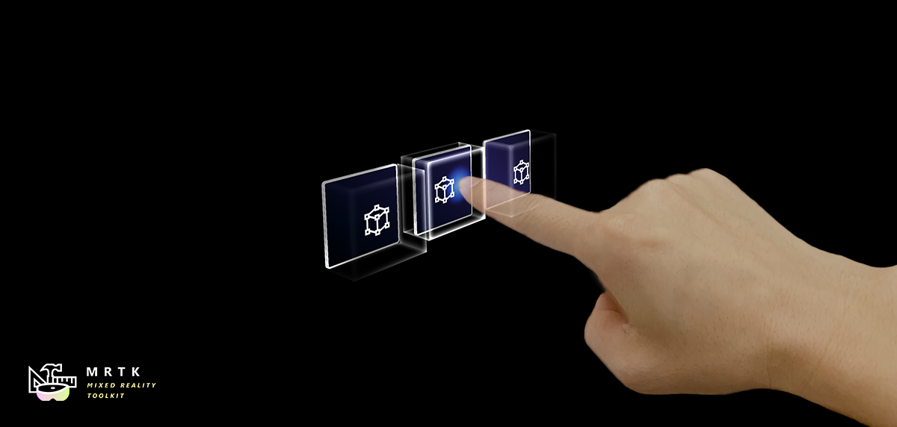
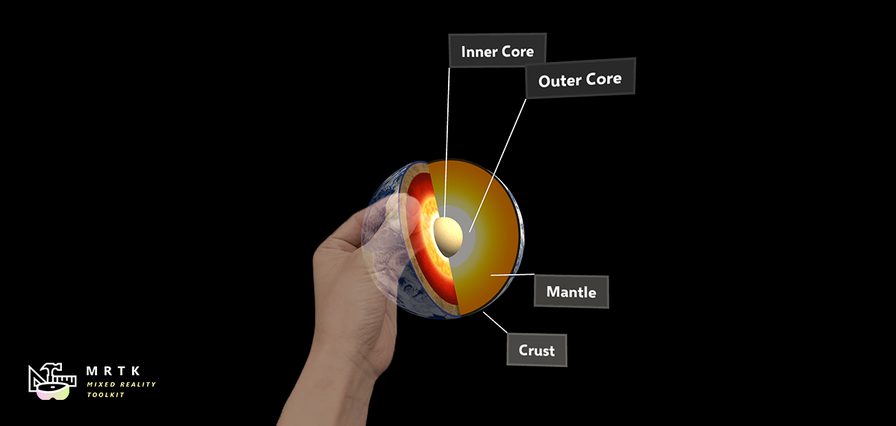
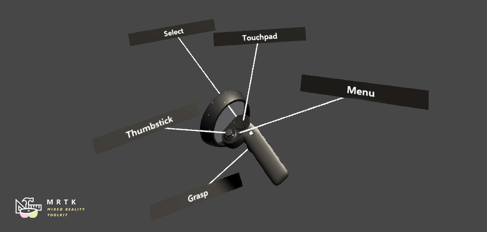
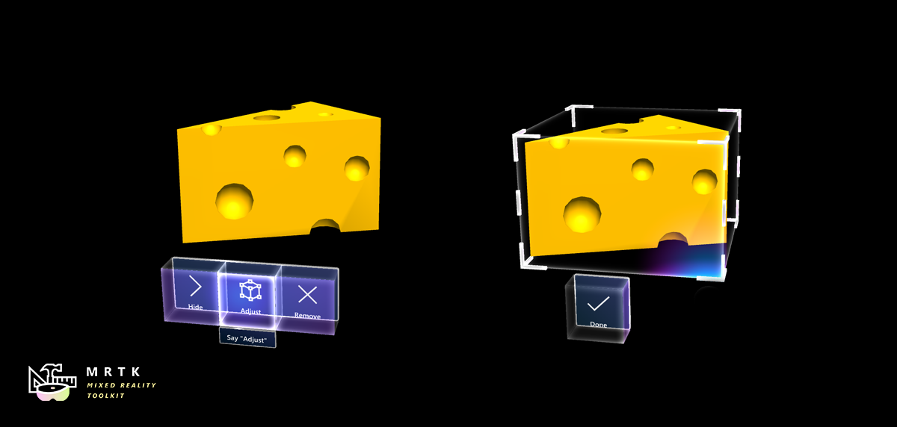

# Getting started with the Mixed Reality Toolkit

The Mixed Reality Toolkit (MRTK) is a cross-platform toolkit for building Mixed Reality experiences for Virtual Reality (VR) and Augmented Reality (AR).

## Prerequisites

To get started with the Mixed Reality Toolkit you will need:

* [Visual Studio 2017](http://dev.windows.com/downloads)
* [Unity 2018.3.x](https://unity3d.com/get-unity/download/archive)
* [Latest MRTK release](https://github.com/Microsoft/MixedRealityToolkit-Unity/releases)
* You don't need this to simulate in Unity Editor or run in VR, but if you want to build your MRTK project as a UWP to run on HoloLens, you will need [Windows SDK 18362+](https://www.microsoft.com/en-us/software-download/windowsinsiderpreviewSDK).

## Get the latest MRTK Unity packages
1. Go to the  [MRTK release page](https://github.com/Microsoft/MixedRealityToolkit-Unity/releases).
2. Under Assets, download both `Microsoft.MixedRealityToolkit.Unity.Examples.unitypackage` and `Microsoft.MixedRealityToolkit.Unity.Foundation.unitypackage`
> The Mixed Reality Toolkit is available via [multiple delivery mechanisms](DownloadingTheMRTK.md) and in the future will be available via the Unity package manager.

## Import MRTK packages into your Unity project
1. Create a new Unity project, or open an existing project. When creating a project, make sure to select "3D" as the template type. 

> We used 2018.3.9f1 for this tutorial, though any Unity 2018.3.x release should work.

2. Import the `Microsoft.MixedRealityToolkit.Unity.Foundation.unitypackage` you downloaded by going into "Asset -> Import Package -> Custom Package", selecting the .unitypackage file, ensure all items to import are checked, and then selecting "Import".

3. Import `Microsoft.MixedRealityToolkit.Unity.Examples.unitypackage` following the same steps as above. The examples package is optional but contains useful demonstration scenes for current MRTK features.

> After importing the Foundation package, you may see a setup prompt like the following:
> 
> 
> 
> MRTK is attempting to set up your project for building Mixed Reality solutions by doing the following:
> * Enable XR Settings for your current platform (enabling the XR checkbox).
> * Force Text Serialization / Visible Meta files (recommended for Unity projects using source control).
>
> Accepting these options is completely optional, but recommended.

> Some prefabs and assets require TextMesh Pro, meaning you have to have the TextMesh Pro package installed and the assets in your project (Window -> TextMeshPro -> Import TMP Essential Resources). **After you import TMP Essentials Resources, you need to restart Unity to see changes**.

## Open and run the HandInteractionExamples scene in editor

The [hand interaction examples scene](README_HandInteractionExamples.md) is a great place to get started because it shows a wide variety of UX controls and interactions in MRTK. To get started we will import MRTK, open the example scene, and explore the scene in the editor.

1. Create a new Unity project and then import both the **Foundation** and **Examples** unity packages following [the steps above](#import-mrtk-packages-into-your-unity-project).
2. Open the HandInteractionExamples scene under `Assets\MixedRealityToolkit.Examples\Demos\HandTracking\Scenes\HandInteractionExamples`

3. You will get a prompt asking you to import "TMP Essentials". 

8. Select "Import TMP essentials" button. "TMP Essentials" refers to TextMeshPro plugin, which some of the MRTK examples use for improved text rendering.

9. Close the TMPPro dialog. After this you need to reload the scene, so close and re-open your scene.

10. Press the play button.

Have fun exploring the scene! You can use simulated hands to interact in editor. You can:
- Press WASD keys to fly / move.
- Press and hold right mouse to look around.
- Press and hold space bar to use a simulated hand.

There's quite a bit to explore here. You can learn more about the UI controls [in the hand interaction examples guide](README_HandInteractionExamples.md). Also, read through [input simulation docs](InputSimulation/InputSimulationService.md) to learn more about in-editor hand input simulation in MRTK.

Congratulations, you just used your first MRTK scene. Now onto creating your own experiences...

## Add MRTK to a new scene or new project

1. Create a new Unity project, or start a new scene in your current project. 

2. Make sure you have imported the MRTK packages (we recommend both Foundation and Examples, though Examples is not required) following [the steps above](#import-mrtk-packages-into-your-unity-project).

3. From the menu bar, select Mixed Reality Toolkit -> Add to Scene and Configure

4. You will see a prompt like this:

Click "OK". 

5. You will then be prompted to choose an MRTK Configuration profile. Double click "DefaultMixedRealityToolkitConfigurationProfile".

> **Note**  Note that the other configuration profiles in this picker are from other scenes in the examples 
package. If you did not install the examples package, you would not have been prompted to 
choose a specific profile (as the foundation package only contains a single
MixedRealityToolkitConfigurationProfile - the default one). The other profiles are part of their
respective example scenes (for example, the HandInteractionAllExampleMixedRealityToolkitConfigurationProfile)
is part of the [HandInteractionExamples scene](README_HandInteractionExamples.md).

You will then see the following in your Scene hierarchy:

Which contains the following:

* Mixed Reality Toolkit - The toolkit itself, providing the central configuration entry point for the entire framework.
* MixedRealityPlayspace - The parent object for the headset, which ensures the headset / controllers and other required systems are managed correctly in the scene.
* The Main Camera is moved as a child to the Playspace - Which allows the playspace to manage the camera in conjunction with the SDK's

> **Note** While working in your scene, **DO NOT move the Main Camera** (or the playspace) from the scene origin (0,0,0).  This is controlled by the MRTK and the active SDK.
> If you need to move the players start point, then **move the scene content and NOT the camera**!

6. Hit play and test out hand simulation by pressing spacebar.

You are now ready to start building your project!

## Next steps

Here are some suggested next steps:

* Add a [PressableButton](README_Button.md) to your scene (we recommend using the `PressableButtonPlated` prefab to start)).
* Add a cube to your scene, then make it movable using the [ManipulationHandler](README_ManipulationHandler.md) component.
* Learn about the UX controls available in MRTK in [building blocks for UI and interactions](#building-blocks-for-ui-and-interactions).
* Read through [input simulation guide](InputSimulation/InputSimulationService.md) to learn how to simulate hand input in editor.
* Learn how to work with the MRTK Configuration profile in the [mixed reality configuration guide](MixedRealityConfigurationGuide.md).

## Building blocks for UI and Interactions
|   [Button](README_Button.md) |  [Bounding Box](README_BoundingBox.md) |  [Manipulation Handler](README_ManipulationHandler.md) |
|:--- | :--- | :--- |
| A button control which supports various input methods including HoloLens2's articulated hand | Standard UI for manipulating objects in 3D space | Script for manipulating objects with one or two hands |
|   [Slate](README_Slate.md) |  [System Keyboard](README_SystemKeyboard.md) |  [Interactable](README_Interactable.md) |
| 2D style plane which supports scrolling with articulated hand input | Example script of using the system keyboard in Unity  | A script for making objects interactable with visual states and theme support |
|   [Solver](README_Solver.md) |  [Object Collection](README_ObjectCollection.md) |  [Tooltip](README_Tooltip.md) |
| Various object positioning behaviors such as tag-along, body-lock, constant view size and surface magnetism | Script for lay out an array of objects in a three-dimensional shape | Annotation UI with flexible anchor/pivot system which can be used for labeling motion controllers and object. |
|   [App Bar](README_AppBar.md) |  [Pointers](README_Pointers.md) |  [Fingertip Visualization](README_FingertipVisualization.md) |
| UI for Bounding Box's manual activation | Learn about various types of pointers | Visual affordance on the fingertip which improves the confidence for the direct interaction |

# Upgrading from the HoloToolkit (HTK/MRTK v1)

There is not a direct upgrade path from the HoloToolkit to Mixed Reality Toolkit v2 due to the rebuilt framework. However, it is possible to import the MRTK into your HoloToolkit project and migrate your implementation. For more information please see the [HoloToolkit to Mixed Reality Toolkit Porting Guide](HTKToMRTKPortingGuide.md)

