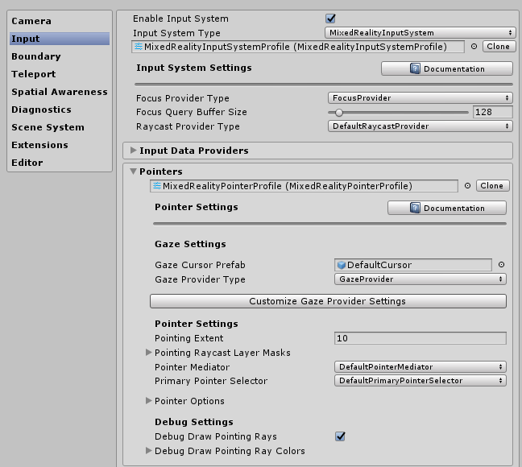
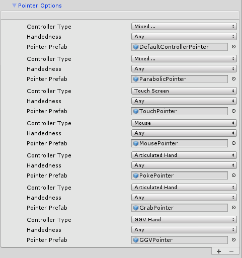
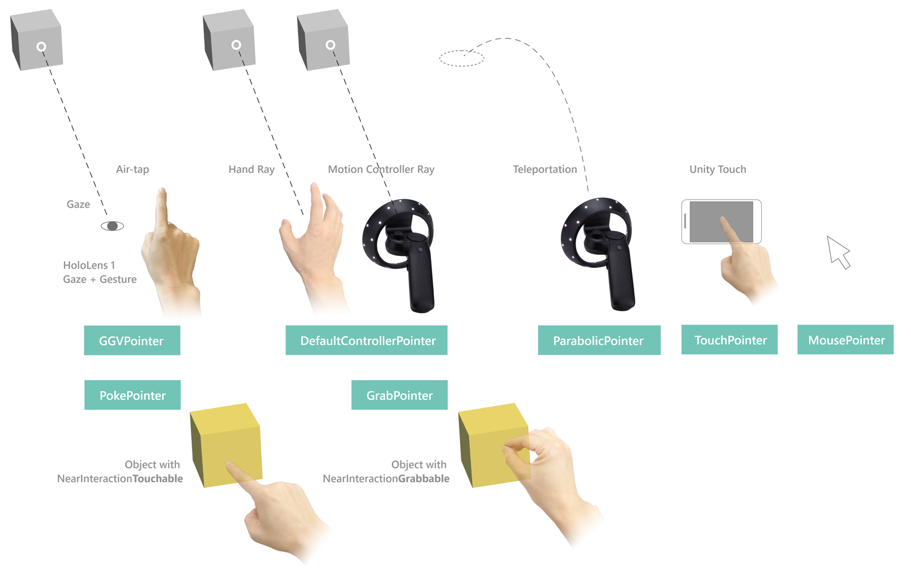

# Pointers


This article discusses how to configure and respond to Pointer input in practice, compared to [Pointer Architecture](../Architecture/InputSystem/ControllersPointersAndFocus.md)

Pointers are instanced automatically at runtime when a new controller is detected. More than one pointer can be attached to a controller. For example, with the default pointer profile, Windows Mixed Reality controllers get both a line and a parabolic pointer for normal selection and teleportation respectively.

## Pointer configuration

Pointers are configured as part of the Input System in MRTK via a [`MixedRealityPointerProfile`](xref:Microsoft.MixedReality.Toolkit.Input.MixedRealityPointerProfile). This type of profile is assigned to a [`MixedRealityInputSystemProfile`](xref:Microsoft.MixedReality.Toolkit.Input.MixedRealityInputSystemProfile) in the MRTK Configuration inspector. The Pointer profile determines the cursor, types of Pointers available at runtime, and how those pointers communicate with each other to decide which one is active.

- *Pointing Extent* - Defines the max distance for which a Pointer can interact with a GameObject.

- *Pointing Raycast Layer Masks* - This is a prioritized array of LayerMasks to determine what possible GameObjects any given Pointer can interact and the order of interaction to attempt. This is may be useful to ensure Pointers interact with UI elements first before other scene objects.



### Pointer options configuration

The default MRTK Pointer Profile configuration includes the following pointer classes and associated prefabs out-of-box. The list of pointers available to the system at runtime is defined under *Pointer Options* in the Pointer profile. Developers can utilize this list to reconfigure existing Pointers, add new Pointers, or delete one.



Each pointer entry pointer is defined by the following set of data:

- *Controller Type* - The set of controllers that a pointer is valid for.
    * For example, the *PokePointer* is responsible for "poking" objects with a finger, and is, by default marked as only supporting the articulated hand controller type. Pointers are only instantiated when a controller becomes available and in particular the *Controller Type* defines what controllers this pointer prefab can be created with.

- *Handedness* - allows for a pointer to only being instantiated for a specific hand (left/right)

> [!NOTE]
> Setting the *Handedness* property of a Pointer entry to *None* will effectively disable it from the system as an alternative to removing that Pointer from the list.

- *Pointer Prefab* - This prefab asset will be instantiated when a controller matching the specified controller type and handedness starts being tracked.

It is possible to have multiple pointers associated with a controller. For example, in the [default HoloLens 2 profile](https://github.com/microsoft/MixedRealityToolkit-Unity/blob/mrtk_development/Assets/MixedRealityToolkit.SDK/Profiles/HoloLens2/DefaultHoloLens2InputSystemProfile.asset)
the articulated hand controller is associated with the *PokePointer*, *GrabPointer*, and the *DefaultControllerPointer* (i.e hand rays).

> [!NOTE]
> MRTK provides a set of pointer prefabs in *Assets/MixedRealityToolkit.SDK/Features/UX/Prefabs/Pointers*. A new custom prefab can be built as long as it contains one of the pointer scripts in *Assets/MixedRealityToolkit.SDK/Features/UX/Scripts/Pointers* or any other script implementing [`IMixedRealityPointer`](xref:Microsoft.MixedReality.Toolkit.Input.IMixedRealityPointer).

### Default pointer classes

The following classes are the out-of-box MRTK pointers available and defined in the default *MRTK Pointer Profile* outlined above. Each pointer prefab provided under *Assets/MixedRealityToolkit.SDK/Features/UX/Prefabs/Pointers* contains one of these pointer components attached.



#### Far pointers

##### [`LinePointer`](xref:Microsoft.MixedReality.Toolkit.Input.LinePointer)

 A base pointer class, draws lines from the source of the input (i.e. the controller) in the pointer direction. Generally, children classes such  the [`ShellHandRayPointer`](xref:Microsoft.MixedReality.Toolkit.Input.ShellHandRayPointer) and the teleport pointers are instantiated and utilized (which also draw lines to indicate where teleportation will end up at) instead of this class which primarily provides common functionality.

For motion controllers like in Oculus, Vive, Windows Mixed Reality, the rotation will match the rotation of the controller. For other controllers like HoloLens 2 articulated hands, the rotation matches the system-provided pointing pose of the hand.


##### [`ShellHandRayPointer`](xref:Microsoft.MixedReality.Toolkit.Input.ShellHandRayPointer)

The implementation type, which extends from [`LinePointer`](xref:Microsoft.MixedReality.Toolkit.Input.MousePointer), used as the default for the *MRTK Pointer Profile*. The *DefaultControllerPointer* prefab implements the [`ShellHandRayPointer`](xref:Microsoft.MixedReality.Toolkit.Input.ShellHandRayPointer) class.

##### [`GGVPointer`](xref:Microsoft.MixedReality.Toolkit.Input.GGVPointer)

Also known as the Gaze/Gesture/Voice pointer, the GGVPointer powers HoloLens 1-style look and tap interactions, primarily via Gaze and Air Tap or Gaze and voice Select interaction. The GGV pointer's position and direction is driven by the head's position and rotation.

##### [`TouchPointer`](xref:Microsoft.MixedReality.Toolkit.Input.TouchPointer)

The TouchPointer is responsible for working with Unity Touch input (i.e. touchscreen). These are 'far interactions' because the act of touching the screen will cast a ray from the camera to a potentially far location in the scene.

##### [`MousePointer`](xref:Microsoft.MixedReality.Toolkit.Input.MousePointer)

The MousePointer powers a screen to world raycast for far interactions, but for mouse instead of touch.

> [!NOTE] Mouse support is not available by default in MRTK but can be enabled by adding a new *Input Data Provider* of type [`MouseDeviceManager`](xref:Microsoft.MixedReality.Toolkit.Input.UnityInput.MouseDeviceManager) to the MRTK input profile.


#### Near pointers

##### [`PokePointer`](xref:Microsoft.MixedReality.Toolkit.Input.PokePointer)

The PokePointer is used to interact with game objects that support “near interaction touchable.” which are GameObjects that have an attached [`NearInteractionTouchable`](xref:Microsoft.MixedReality.Toolkit.Input.NearInteractionTouchable) script. In the case of UnityUI, this pointer looks for NearInteractionTouchableUnityUIs.  The PokePointer uses a SphereCast to determine the closest touchable element and is used to power things like the pressable buttons.

 When configuring the GameObject with the [`NearInteractionTouchable`](xref:Microsoft.MixedReality.Toolkit.Input.NearInteractionTouchable) component, make sure to configure the *localForward* parameter to point out of the front of the button or other object that should be made touchable. Also make sure that the touchable's *bounds* matches the bounds of the touchable object.

Useful Poke Pointer properties:

- *TouchableDistance*: Maximum distance a which a touchable surface can be interacted with
- *Visuals*: Game object used to render finger tip visual (the ring on finger, by default).
- *Line*: Optional line to draw from fingertip to the active input surface.


##### [`SpherePointer`](xref:Microsoft.MixedReality.Toolkit.Input.SpherePointer)

The SpherePointer uses [UnityEngine.Physics.OverlapSphere](https://docs.unity3d.com/ScriptReference/Physics.OverlapSphere.html) in order to identify the closest [`NearInteractionGrabbable`](xref:Microsoft.MixedReality.Toolkit.Input.NearInteractionGrabbable) object for interaction which is useful for "grabbable" input like the `ManipulationHandler`. Similar to the [`PokePointer`](xref:Microsoft.MixedReality.Toolkit.Input.PokePointer)/[`NearInteractionTouchable`](xref:Microsoft.MixedReality.Toolkit.Input.NearInteractionTouchable) functional pair, in order to be interactable with the Sphere Pointer, the game object must contain a component that is the [`NearInteractionGrabbable`](xref:Microsoft.MixedReality.Toolkit.Input.NearInteractionGrabbable) script.

Useful Sphere Pointer properties:

- *Sphere Cast Radius*: The radius for the sphere used to query for grabbable objects.
- *Debug Mode*: If true, draw the sphere that is used to query for grabbable objects.


#### Teleport pointers

- [`TeleportPointer`](xref:Microsoft.MixedReality.Toolkit.Teleport.TeleportPointer) will raise a teleport request when action is taken (i.e the teleport button is pressed) in order to move the user.
- [`ParabolicTeleportPointer`](xref:Microsoft.MixedReality.Toolkit.Teleport.ParabolicTeleportPointer) will raise a teleport request when action is taken (i.e the teleport button is pressed) with a parabolic line raycast in order to move the user.


## Pointer interactions via code

### Pointer event interfaces

MonoBehaviors that implement one or more of the following interfaces and are assigned to a GameObject with a `Collider` will receive Pointer interactions events as defined by the associated interface. 

| Event | Description | Handler |
| --- | --- | --- |
| Before Focus Changed / Focus Changed | Raised on both the game object losing focus and the one gaining it every time a pointer changes focus. | `IMixedRealityFocusChangedHandler` [API](xref:Microsoft.MixedReality.Toolkit.Input.IMixedRealityFocusChangedHandler) |
Focus Enter / Exit | Raised on the game object gaining focus when the first pointer enters it and on the one losing focus when the last pointer leaves it. | [`IMixedRealityFocusHandler`](xref:Microsoft.MixedReality.Toolkit.Input.IMixedRealityFocusHandler)
Pointer Down / Dragged / Up / Clicked | Raised to report pointer press, drag and release. | [`IMixedRealityPointerHandler`](xref:Microsoft.MixedReality.Toolkit.Input.IMixedRealityPointerHandler)
Touch Started / Updated / Completed | Raised by touch-aware pointers like [`PokePointer`](xref:Microsoft.MixedReality.Toolkit.Input.PokePointer) to report touch activity. | [`IMixedRealityTouchHandler`](xref:Microsoft.MixedReality.Toolkit.Input.IMixedRealityTouchHandler)

> [!NOTE]
> [`IMixedRealityFocusChangedHandler`](xref:Microsoft.MixedReality.Toolkit.Input.IMixedRealityFocusChangedHandler) and [`IMixedRealityFocusHandler`](xref:Microsoft.MixedReality.Toolkit.Input.IMixedRealityFocusHandler) should be handled in the objects they are raised on. It is possible to receive focus events globally but, unlike other input events, global event handler won't block receiving events based on focus (the event will be received by both global handler and a corresponding object in focus).

#### Example

Below is an example script that changes the color of the attached renderer when a pointer takes or leaves focus or when a pointer selects the object.

```csharp
  public class ColorTap : MonoBehaviour, IMixedRealityFocusHandler, IMixedRealityPointerHandler
    {
        private Color color_IdleState = Color.cyan;
        private Color color_OnHover = Color.white;
        private Color color_OnSelect = Color.blue;
        private Material material;

        private void Awake()
        {
            material = GetComponent<Renderer>().material;
        }

        private void IMixedRealityFocusHandler.OnFocusEnter(FocusEventData eventData)
        {
            material.color = color_OnHover;
        }

        private void IMixedRealityFocusHandler.OnFocusExit(FocusEventData eventData)
        {
            material.color = color_IdleState;
        }

        private void IMixedRealityPointerHandler.OnPointerDown(MixedRealityPointerEventData eventData) {}

        private void IMixedRealityPointerHandler.OnPointerDragged(MixedRealityPointerEventData eventData) { }

        private void IMixedRealityPointerHandler.OnPointerClicked(MixedRealityPointerEventData eventData) 
        {
            material.color = color_OnSelect;
        }
```

### Query Pointers

It is possible to gather all pointers currently active by looping through the available input sources (i.e controllers and inputs available) to discover which pointers are attached to them.

```csharp
    HashSet<IMixedRealityPointer> pointers = new HashSet<IMixedRealityPointer>();

    // Find all valid pointers
    foreach (var inputSource in CoreServices.InputSystem.DetectedInputSources)
    {
        foreach (var pointer in inputSource.Pointers)
        {
            if (pointer.IsInteractionEnabled && !pointers.Contains(pointer))
            {
                pointers.Add(pointer);
            }
        }
    }
```

#### Primary Pointer

Developers can subscribe to the FocusProviders PrimaryPointerChanged event to be notified when the primary pointer in focus has changed. This can be extremely useful to identify if the user is currently interacting with a scene via gaze or a hand ray or other input source.

```csharp
    private void OnEnable()
    {
        CoreServices.InputSystem?.FocusProvider?.SubscribeToPrimaryPointerChanged(OnPrimaryPointerChanged, true);
    }

    private void OnPrimaryPointerChanged(IMixedRealityPointer oldPointer, IMixedRealityPointer newPointer)
    {
        ...
    }

    private void OnDisable()
    {
        CoreServices.InputSystem?.FocusProvider?.UnsubscribeFromPrimaryPointerChanged(OnPrimaryPointerChanged);
        // This flushes out the current primary pointer
        OnPrimaryPointerChanged(null, null);
    }
```

The [PrimaryPointerExample scene](https://github.com/microsoft/MixedRealityToolkit-Unity/tree/mrtk_development/Assets/MixedRealityToolkit.Examples/Demos/Input/Scenes/PrimaryPointer/PrimaryPointerExample.unity) shows how to use the [`PrimaryPointerChangedHandler`](xref:Microsoft.MixedReality.Toolkit.Input.PrimaryPointerChangedHandler) for events to respond to a new primary pointer.


### Pointer Result

The pointer [`Result`](xref:Microsoft.MixedReality.Toolkit.Input.IMixedRealityPointer.Result) property contains the current result for the scene query used to determine the object with focus. For a raycast pointer, like the ones created by default for motion controllers, gaze input and hand rays, it will contain the location and normal of the raycast hit.

```csharp
    private void IMixedRealityPointerHandler.OnPointerClicked(MixedRealityPointerEventData eventData)
    {
        var result = eventData.Pointer.Result;
        Instantiate(MyPrefab, result.Details.Point, Quaternion.LookRotation(result.Details.Normal));
    }
```

The [PointerResultExample scene](https://github.com/microsoft/MixedRealityToolkit-Unity/tree/mrtk_development/Assets/MixedRealityToolkit.Examples/Demos/Input/Scenes/PointerResult/PointerResultExample.unity) shows how to use the pointer [`Result`](xref:Microsoft.MixedReality.Toolkit.Input.IMixedRealityPointer.Result) to spawn an object at the hit location.


## Pointer interactions via editor

For pointer events handled by [`IMixedRealityPointerHandler`](xref:Microsoft.MixedReality.Toolkit.Input.IMixedRealityPointerHandler), MRTK provides further convenience in the form of the [`PointerHandler`](xref:Microsoft.MixedReality.Toolkit.Input.PointerHandler) component which allows pointer events to be handled directly via Unity Events.


## See Also

- [Pointer Architecture](../Architecture/InputSystem/ControllersPointersAndFocus.md)
