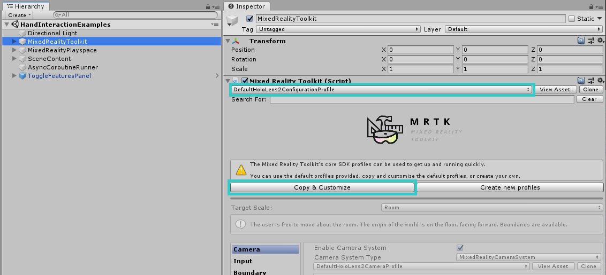
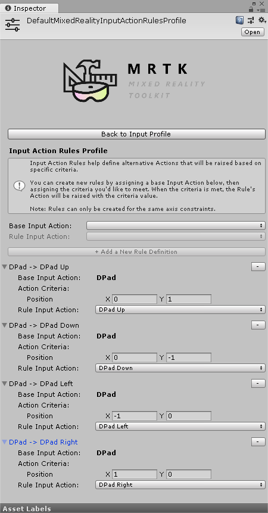
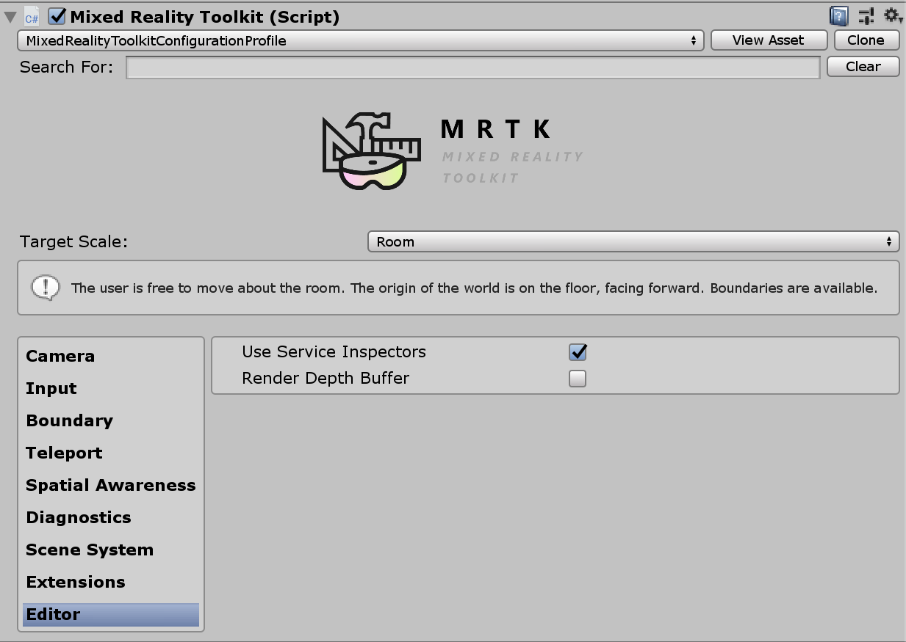
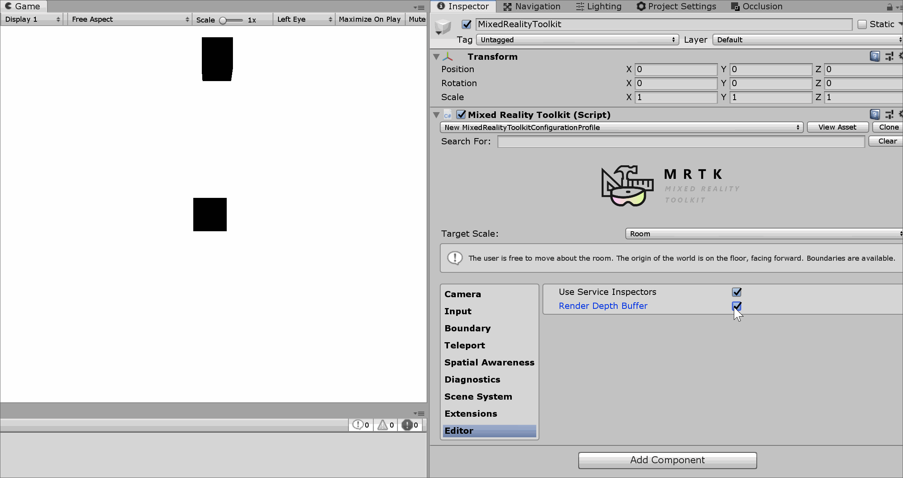

# Mixed Reality Toolkit Profile configuration guide

The Mixed Reality Toolkit centralizes as much of the configuration required to manage the toolkit as possible (except for true runtime "things").

> **This guide is a simple walkthrough for each of the configuration profile screens currently available for the toolkit**

## The main Mixed Reality Toolkit configuration profile

The main configuration profile, which is attached to the *MixedRealityToolkit* GameObject in your Scene, provides the main entry point for the Toolkit in your project.

> [!NOTE]
> The Mixed Reality Toolkit "locks" the default configuration screens to ensure you always have a common start point for your project and it is encouraged to start defining your own settings as your project evolves. The MRTK configuration is not editable during playmode.

All the "default" profiles for the Mixed Reality Toolkit can be found in the SDK project in the folder Assets\MixedRealityToolkit.SDK\Profiles

> [!IMPORTANT]
> DefaultHoloLens2ConfigurationProfile is optimized for HoloLens 2. See [Profiles](Profiles/Profiles.md) for the details.

When you open the main Mixed Reality Toolkit Configuration Profile, you will see the following screen in the inspector:

If you select a MixedRealityToolkitConfigurationProfile asset without the MixedRealityToolkit in the scene, it will ask you if you want the MRTK to automatically setup the scene for you. This is optional, however, there must be an active MixedRealityToolkit object in the scene to access all the configuration screens.

This houses the current active runtime configuration for the project.

> [!NOTE]
> Almost any profile can be swapped out at runtime, with the exception of the InputActions configuration (see later). The profiles with then automatically adapt to the new configuration / runtime environment automatically.

From here you can navigate to all the configuration profiles for the MRTK, including:

* [Experience settings](#experience)
* [Camera settings](#camera)
* [Input system settings](#input-system-settings)
* [Boundary settings](#boundary)
* [Teleporting settings](#teleportation)
* [Spatial awareness settings](#spatialawareness)
* [Diagnostics settings](#diagnostic)
* [Scene system settings](#scenesystem)
* [Additional services settings](#services)
* [Input actions settings](#inputactions)
* [Input actions rules](#inputactionrules)
* [Pointer configuration](#pointer)
* [Gestures configuration](#gestures)
* [Speech commands](#speech)
* [Controller mapping configuration](#mapping)
* [Controller visualization settings](#visualization)
* [Editor Utilities](#editor-utilities)

These configuration profiles are detailed below in their relevant sections:

---

## Experience settings

Located on the main Mixed Reality Toolkit configuration page, this setting defines the default operation of the Mixed Reality environment for your project.

---

## Camera settings

The camera settings define how the camera will be setup for your Mixed Reality project, defining the generic clipping, quality and transparency settings.

---

## Input system settings

The Mixed Reality Project provides a robust and well-trained input system for routing all the input events around the project which is selected by default.

Behind the Input System provided by the MRTK are several other systems, these help to drive and manage the complex inter-weavings required to abstract out the complexities of a multi-platform / mixed reality framework.

Each of the individual profiles are detailed below:

* Focus Settings
* [Input actions settings](#input-actions-settings)
* [Input actions rules](#inputactionrules)
* [Pointer configuration](#pointer)
* [Gestures configuration](#gestures)
* [Speech commands](#speech)
* [Controller mapping configuration](#mapping)
* [Controller visualization settings](#visualization)

---

## Boundary visualization settings

The boundary system translates the perceived boundary reported by the underlying platforms boundary / guardian system. The Boundary visualizer configuration gives you the ability to automatically show the recorded boundary within your scene relative to the user's position.The boundary will also react / update based on where the user teleports within the scene.

---

## Teleportation system selection

The Mixed Reality Project provides a full featured Teleportation system for managing teleportation events in the project which is selected by default.

---

## Spatial awareness settings

The Mixed Reality Project provides a rebuilt spatial awareness system for working with spatial scanning systems in the project which is selected by default.
You can view the architecture behind the [MRTK Spatial awareness system here](../Documentation/Architecture/SpatialAwareness.md).

The Mixed Reality Toolkit spatial awareness configuration lets you tailor how the system starts, whether it is automatically when the application starts
or later programmatically as well as setting the extents for the field of view.

It also lets you configure the mesh and surface settings, further customizing how your project understands the environment around you.

This is only applicable for devices that can provide a scanned environment.

---

## Diagnostics settings

An optional but highly useful feature of the MRTK is the plugin diagnostics functionality.

The diagnostics profile provides several simple systems to monitor whilst the project is running, including a handy On/Off switch to enable / disable the display panel in the scene.

---

## Scene system settings

The MRTK provides this optional service to help you manage complex additive scene loading / unloading. To decide if the Scene System would be a good fit for your project, read the [Scene System Getting Started Guide.](SceneSystem/SceneSystemGettingStarted.md)

---

## Additional services settings

One of the more advanced areas of the Mixed Reality Toolkit is its [service locator pattern](https://en.wikipedia.org/wiki/Service_locator_pattern) implementation which allows the registering of any "Service" with the framework. This allows the framework to be both extended with new features / systems easily but also allows for projects to take advantage of these capabilities to register their own runtime components.

Any registered service still gets the full advantage of all of the Unity events, without the overhead and cost of implementing a MonoBehaviour or clunky singleton patterns. This allows for pure C# components with no scene overhead for running both foreground and background processes, e.g. spawning systems, runtime game logic, or practically anything else.

---

## Input actions settings

Input actions provide a way to abstract any physical interactions and input from a runtime project. All physical input (from controllers / hands / mouse / etc) is translated in to a logical input action for use in your runtime project. This ensures no matter where the input comes from, your project simply implements these actions as "Things to do" or "Interact with" in your scenes.

To create a new input action, simply click the "Add a new Action" button and enter a friendly text name for what it represents. You then only need select an axis (the type of data) the action is meant to convey, or in the case of physical controllers, the physical input type it can be attached to, for example:

| Axis Constraint | Data Type | Description | Example use |
| :--- | :--- | :--- | :--- |
| None | No data | Used for an empty action or event | Event Trigger |
| Raw (reserved) | object | Reserved for future use | N/A |
| Digital | bool | A boolean on or off type data | A controller button |
| Single Axis | float | A single precision data value | A ranged input, e.g. a trigger |
| Dual Axis | Vector2 | A dual float type date for multiple axis | A Dpad or Thumbstick |
| Three Dof Position | Vector3 | Positional type data from with 3 float axis | 3D position style only controller |
| Three Dof Rotation | Quaternion | Rotational only input with 4 float axis | A Three degrees style controller, e.g. Oculus Go controller |
| Six Dof | Mixed Reality Pose (Vector3, Quaternion) | A position and rotation style input with both Vector3 and Quaternion components | A motion controller or Pointer |

Events utilizing input actions are not limited to physical controllers and can still be utilized within the project to have runtime effects generate new actions.

> [!NOTE]
> Input actions are one of the few components which is not editable at runtime, they are a design time configuration only. This profile should not be swapped out whilst the project is running due to the framework (and your projects) dependency on the ID's generated for each action.

---

## Input actions rules

Input action rules provide a way to automatically translate an event raised for one input action in to different actions based on its data value. These are managed seamlessly within the framework and do not incur any performance costs.

For example, converting the single dual axis input event from a DPad in to the 4 corresponding "Dpad Up" / "DPad Down" / "Dpad Left" / "Dpad Right" actions (as shown in the image below).

This could also be done in your own code. However, seeing as this was a very common pattern, the framework provides a mechanism to do this "out of the box"

Input action Rules can be configured for any of the available input axis. However, input actions from one axis type can be translated to another input action of the same axis type. You can map a dual axis action to another dual axis action, but not to a digital or none action.

---

## Pointer configuration

Pointers are used to drive interactivity in the scene from any input device, giving both a direction and hit test with any object in a scene (that has a collider attached, or is a UI component). Pointers are by default automatically configured for controllers, headsets (gaze / focus) and mouse / touch input.

Pointers can also be visualized within the active scene using one of the many line components provided by the Mixed Reality Toolkit, or any of your own if they implement the MRTK IMixedRealityPointer interface.

* Pointing Extent: Determines the global pointing extent for all pointers, including gaze.
* Pointing Raycast Layer Masks: Determines which layers pointers will raycast against.
* Debug Draw Pointing Rays: A debug helper for visualizing the rays used for raycasting.
* Debug Draw Pointing Rays Colors: A set of colors to use for visualizing.
* Gaze cursor prefab: Makes it easy to specify a global gaze cursor for any scene.

There's an additional helper button to quickly jump to the Gaze Provider to override some specific values for Gaze if needed.

---

## Gestures configuration

Gestures are a system specific implementation allowing you to assign input actions to the various "Gesture" input methods provided by various SDKs (e.g. HoloLens).

> [!NOTE]
> The current Gestures implementation is for the HoloLens only and will be enhanced for other systems as they are added to the Toolkit in the future (no dates yet).

---

## Speech Commands

Like gestures, some runtime platforms also provide intelligent "Speech to Text" functionality with the ability to generate commands that can be received by a Unity project. This configuration profile allows you to configure the following:

1. General Settings - "Start Behavior" set to Auto Start or Manual Start determines whether to initialize KeywordRecognizer at input system startup or let the project decide when to initialize the KeywordRecognizer. "Recognition Confidence Level" is used to initialize Unity's [KeywordRecognizer API](https://docs.unity3d.com/ScriptReference/Windows.Speech.KeywordRecognizer-ctor.html)
2. Speech Commands - Registers "words" and translates them in to input actions that can be received by your project. They can also be attached to keyboard actions if required.

> [!IMPORTANT]
> The system currently only supports speech when running on Windows 10 platforms, e.g. HoloLens and Windows 10 desktop and will be enhanced for other systems as they are added to MRTK in the future (no dates yet).

---

## Controller mapping configuration

One of the core configuration screens for the Mixed Reality Toolkit is the ability to configure and map the various types of controllers that can be utilized by your project.

The configuration screen below allows you to configure any of the controllers currently recognized by the toolkit.

The MRTK provides a default configuration for the following controllers / systems:

* Mouse (including 3D spatial mouse support)
* Touch Screen
* Xbox controllers
* Windows Mixed Reality controllers
* HoloLens Gestures
* HTC Vive wand controllers
* Oculus Touch controllers
* Oculus Remote controller
* Generic OpenVR devices (advanced users only)

Clicking on the Image for any of the pre-built controller systems allows you to configure a single input action for all its corresponding inputs, for example, see the Oculus Touch controller configuration screen below:

There is also an advanced screen for configuring other OpenVR or Unity input controllers that are not identified above.

---

## Controller visualization settings

In addition to the controller mapping, a separate configuration profile is provided to customize how your controllers are presented within your scenes.

This can be configured at a "Global" (all instances of a controller for a specific hand) or specific to an individual controller type / hand.

The MRTK also supports native SDK controller models for Windows Mixed Reality and OpenVR. These are loaded as GameObjects in your scene and positioned using the platform's controller tracking.

If your controller representation in the scene needs to be offset from the physical controller position, then simply set that offset against the controller model's prefab (e.g. setting the transform position of the controller prefab with an offset position).

## Editor Utilities

The following utilities work only in the editor and are useful to improve development productivity.

### Service Inspectors

Service Inspectors are an editor-only feature that generates in-scene objects representing active services. Selecting these objects displays inspectors which offer documentation links, control over editor visualizations and insight into the state of the service.

You can enable service inspectors by checking *Use Service Inspectors* under *Editor Settings* in the Configuration Profile.

### Depth Buffer Renderer

Sharing the depth buffer with some mixed reality platforms can improve [hologram stabilization](hologram-stabilization.md). For example, the Windows Mixed Reality platform can modify the rendered scene per-pixel to account for subtle head movements during the time it took to render a frame. However, these techniques require depth buffers with accurate data to know where and how far geometry is from the user.

To ensure a scene renders all necessary data to the depth buffer, developers can toggle the *Render Depth Buffer* feature under *Editor Settings* in the Configuration Profile. This will take the current depth buffer and render it as color to the scene view by applying a post-processing effect, [`DepthBufferRenderer`](xref:Microsoft.MixedReality.Toolkit.Rendering.DepthBufferRenderer), to the main camera.

The blue cylinder in the scene has a material with ZWrite off so no depth data is written

## See Also

* [Hologram Stabilization](hologram-stabilization.md)
