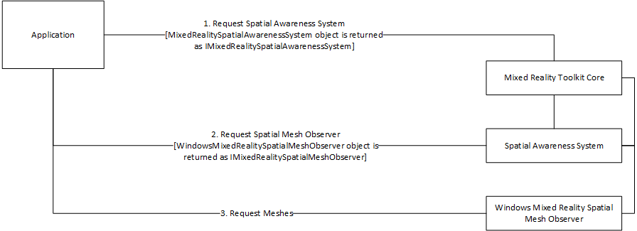

# Mixed Reality Toolkit Componentization

One of the great new features of Mixed Reality Toolkit v2 is improved componentization. Wherever possible, 
individual components are isolated from all but the core layer << >> of the foundation.

The following sections describe the status of the componentization work for each major milestone:

- [Release Candidate 1](#release-candidate-1-status)
- [Release Candidate 2](#release-candidate-2-plan)
- [Official Releaee](#official-release-plan)

> Some features may, by design, take dependencies on MRTK or other components (ex: Unity Plug-ins). 
The package management tools will ensure that the correct dependencies are imported when one of these 
features is selected.

## Release Candidate 1 Status

With the RC1 release of MRTK v2,the majority of the componentization work has been completed. 

- [Minimized dependencies](#minimized-dependencies) between features
- [Component communication](#component-communication) is performed though interfaces 

Scenarios that are not yet fully supported include:
- Built-in package discovery and importing

    > Release Candidate 2 is planned to include support for discovering and importing MRTK foundational 
    packages and extensions via NuGet.

- Application architecture flexibility

    > Release Candidate 1 contains partial support for utilizing MRTK system services in isolation. It is 
    expected that full support will be available in RC2. 

Developers who desire to reduce the MRTK footprint in their applications, guidance for [manual componentization](#manual-componentization) 
is provided. 

### Minimized Dependencies

MRTK v2 was intentionally developed to be modular and to minimize dependencies between system services 
(ex: spatial awareness). 

> Due to the nature of some system services (ex: input and teleportation) a small number of dependencies exist.

While it is expected that services will need one or more data provider components, there are no direct links 
between them. The same is true for SDK features (ex: User Interface components).

### Component Communication

To ensure that there are no direct links between components, MRTK v2 utilizes interfaces to communicate between 
services, data providers and application code. These interfaces are defined in and all communication is routed 
through the Mixed Reality Toolkit core component.

### Manual Componentization

While automatic support for importing specific MRTK components is not available in RC1, developers can manually 
opt-out of specific functionality.

There are two workflows that developers can use to manually componentize MRTK v2:

- [Uncheck features](#uncheck-features) during package import
- [Delete feature folders](#delete-feature-folders)

> If a feature is mistakenly omitted or deleted, the package can be re-imported to add the desired functionality.

#### Uncheck Features

When importing the Microsoft.MixedReality.Toolkit.Unity.Foundation-v2.0.0-RC1.unity package, developers have the 
ability to limit which package contents get added to the project. 

For projects where the required features and/or platforms are well known, unnecessary system services, providers 
and features can be left unchecked to minimize the MRTK footprint.

> NOTE: MRTK v2 **_requires_** the contents of the Assets\MixedRealityToolkit folder. 

#### Delete Feature Folders

After importing the Microsoft.MixedReality.Toolkit.Unity.Foundation-v2.0.0-RC1.unity package, the MRTK footprint can 
be reduced by deleting unneeded folders from:

- MixedRealityToolkit.Services
- MixedRealityToolkit.Providers
- MixedRealityToolkit.SDK\Features

> NOTE: MRTK v2 **_requires_** the contents of the Assets\MixedRealityToolkit folder. 

## Release Candicate 2 Plan

In addition to the [RC1](#release-candidate-1-status) functionality, the RC2 release will include support for:

- Package management tools
- Application architecture flexibility

### Package Management

MRTK v2 RC2 is planned to contain support for discovering and importing service, provider, feature and extension 
packages via NuGet.

> There is planned to be a Mixed Reality Toolkit menu option, in the Editor, to display user interface that allows 
for filtering based on:

> - Component category (Foundation, Extension, Experimental)
> - Company (ex: Microsoft)
> - Feature type tags (ex: Audio)
> - Number of downloads

### Application Architecture

RC2 will have support completed to enable applications to be built with a variety of architectures, including:

- [MixedRealityToolkit service locator](#mixedrealitytoolkit-service-locator)
- [Individual services](#individual-service-components)
- [Custom service locator](#custom-service-locator)
- [Hybrid architecture](#hybrid-architecture)

> When selecting an application architecture, it is important to consider design flexibility and application
performance. The architectures described here are not expected to be suitable for every application.

#### MixedRealityToolkit Service Locator

RC1 enables (and automatically configures) application scenes to use the default [MixedRealityToolkit](xref:Microsoft.MixedReality.Toolkit.MixedRealityToolkit) service locator 
component. This component includes support for configuring MRTK systems and data providers via configuration inspectors
and manages component lifespans and core behaviors (ex: when to update).

All systems are represented in the core configuration inspector, regardless of whether or not they are present or
enabled in the project. Please see the [Mixed Reality Configuration Guide](../MixedRealityConfiguratonGuide.md) for more
information. 

#### Individual Service Components

Some developers have expressed a desire to include individual service components into the application scene hierarchy. 
To enable this usage, services will either need to be encapsulated in a custom registrar or be self-registering / self-managing. 

> A self-registering service would implement the [IMixedRealityServiceRegistrar](xref:Microsoft.MixedReality.Toolkit.IMixedRealityServiceRegistrar) and register itself so that application
code could discover the service instance via a registry.

> A self-managing service could be implemented as a singleton object in the scene hierarchy. This object would provide
and instance property which application code could use to directly access serivce functionality.

#### Custom Service Locator

Some developers have requested the ability to create a custom service locator component. Custom service locators would
implement the [IMixedRealityServiceRegistrar](xref:Microsoft.MixedReality.Toolkit.IMixedRealityServiceRegistrar) interface and manage the lifecycle and core behaviors of active services.

#### Hybrid Architectures

RC2 is planned to support a hybrid architecture in which developers can combine the previous approaches as needed or
desired. For example, a developer could start with the [MixedRealityToolkit](xref:Microsoft.MixedReality.Toolkit.MixedRealityToolkit) service locator and add a self-registering
service.

> When opting for a hybrid architecture, it is important to be mindful of any duplication of work (ex: acquiring 
controller data from multiple components). 

## Official Release Plan

For the official release of MRTK v2, the componentization work will be complete. The expectation is that developers will be 
empowered to:

1. Import the MRTK Core foundation package
2. Use the built-in package management tools to discover and import individual components
3. Select the desired application architecture

## See Also

- [MRTK Packages](MRTK_Packages.md)

