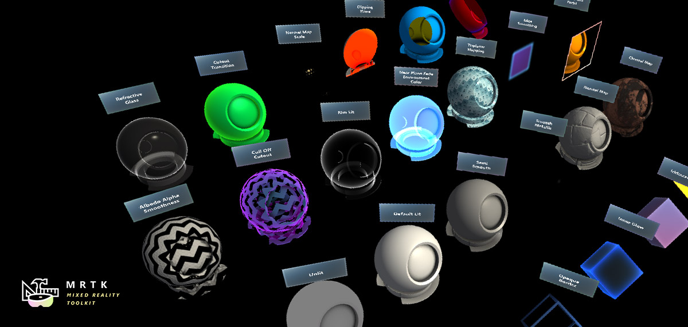

# MRTK Standard Shader

MRTK Standard shading system utilizes a single, flexible shader that can achieve visuals similar to Unity's Standard Shader, implement Fluent Design System principles, and remain performant on mixed reality devices.

## Example scene
You can find the shader examples in the **MaterialGallery** scene under:
[MixedRealityToolkit.Examples/Demos/StandardShader/Scenes/](/Assets/MixedRealityToolkit.Examples/Demos/StandardShader/Scenes)

## Features
Per pixel metallic, smoothness, emissive, and occlusion control via channel maps. For example:

Built in configurable stencil test support to achieve a wide array of effects. Such as portals:

Instanced color support to give thousands of GPU instanced meshes unique material properties (example scene not in this PR):

Finally, a scene to compare and test the MRTK/Standard shader against the Unity/Standard shader:

Single pass instanced stereo rendering has also been enabled by default and a few minor MRTK/Standard shader bugs have been fixed.

### Triplanar mapping
Triplanar mapping is a technique to programmatically texture a mesh. Often used in terrain, meshes without UVs, or difficult to unwrap shapes. This implementation supports world or local space projection, the specification of blending smoothness, and normal map support. Note, each texture used requires 3 texture samples, so please use sparingly in performance critical situations.

A checkbox has also been added to control albedo optimizations. As an optimization albedo operations are disabled when no albedo texture is specified. To control this (as requested by this blog post: http://dotnetbyexample.blogspot.com/2018/10/workaround-remote-texture-loading-does.html) Simply check this box:

The lighting model has been tweaked to match the Unity standard shader a little closer. And, the example comparison scene has been updated to reflect this:

Fresnel lighting on back facing polygons should now look more correct. (Thank you Gerrit Lochmann for the fix).

Finally, normal map scale is now supported and a few extra material gallery examples have been added.

