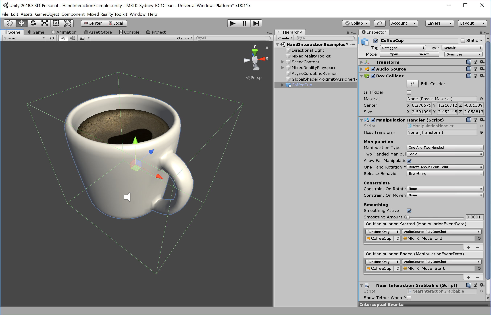
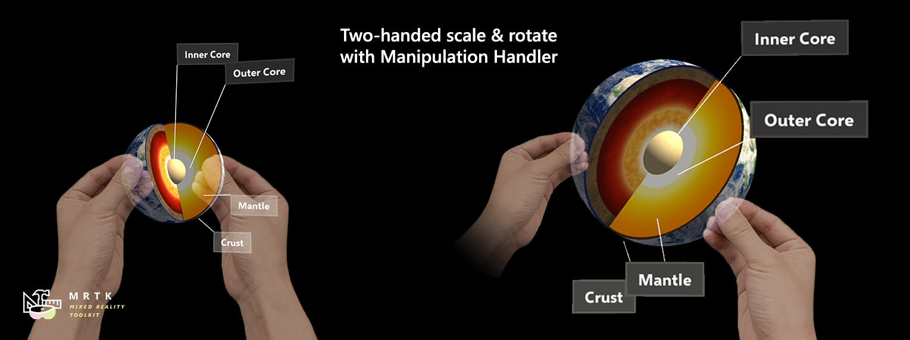

# Manipulation Handler

The ManipulationHandler script allows for an object to be made movable, scalable, and rotatable using one or two hands. Manipulation can be restricted so that it only allows certain kinds of transformation.
The script works with various types of inputs including HoloLens 2 articulated hand input, hand-rays, HoloLens gesture input, and immersive headset motion controller input.

## How to use Manipulation Handler 

In the inspector panel, you will be able to find various options that you can configure. Make sure to add a Collidable to your object -- the collidable should match the grabbable bounds of the object. To make it respond to near articulated hand input, you need to add the NearInteractionGrabbable.cs script as well. 

## Inspector Properties

### Host Transform
Transform that will be dragged. Defaults to the object of the component.

### Manipulation Type
Specifies whether the object can be manipulated using one hand, two hands, or both.
* One handed only
* Two handed only
* One and Two handed

### Two Handed Manipulation Type

* Scale
* Rotate
* Move Scale
* Move Rotate
* Rotate Scale
* Move Rotate Scale

### Allow Far Manipulation
Specifies whether manipulation can be done using far interaction with pointers. 

### One Hand Rotation Mode Near
Specifies how the object will behave when it is being grabbed with one hand/controller near.

### One Hand Rotation Mode Far
Specifies how the object will behave when it is being grabbed with one hand/controller at distance.

### One Hand Rotation Mode Options
* Maintain original rotation - does not rotate object as it is being moved
* Maintain rotation to user - maintains the object's original rotation to the user
* Gravity aligned maintain rotation to user - maintains object's original rotation to user, but makes the object vertical. Useful for bounding boxes.
* Face user - ensures object always faces the user. Useful for slates/panels.
* Face away from user - ensures object always faces away from user. Useful for slates/panels that are configured backwards.
* Rotate about object center - Only works for articulated hands/controllers. Rotate object using rotation of the hand/controller, but about the object center point. Useful for inspecting at a distance.
* Rotate about grab point - Only works for articulated hands/controllers. Rotate object as if it was being held by hand/controller. Useful for inspection.

### Release Behavior
When an object is released, specify its physical movement behavior. Requires a rigidbody component to be on that object.
* Nothing
* Everything
* Keep Velocity
* Keep Angular Velocity

### Constraints on Rotation
* None
* X-Axis Only
* Y-Axis Only
* Z-Axis Only

### Constraints on Movement
* None
* Fix distance from head

### Smoothing Active
Specifies whether smoothing is active.

### Smoothing Amount One Hand
Amount of smoothing to apply to the movement, scale, rotation. Smoothing of 0 means no smoothing. Max value means no change to value.

### Events
* OnManipulationStarted - Fired when manipulation starts
* OnManipulationEnded - Fires when the manipulation ends
* OnHoverStarted - Fires when a hand / controller hovers the manipulatable, near or far
* OnHoverEnded - Fires when a hand / controller un-hovers the manipulatable, near or far
