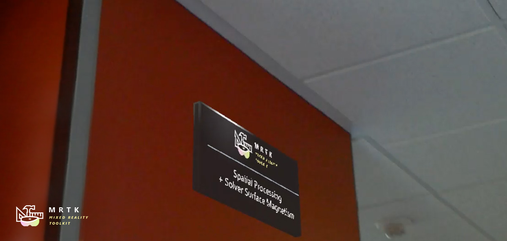

# Solver

At this time, there is no easy, reliable way to specify the update order for Unity components. This can make it difficult to implement deterministic compound transformations. The solver system addresses this issue.

Building on this, Solvers offer a range of follow behaviors (eg tag-along) which can be safely stacked (eg, tag-along + surface magnetism + momentum).

## Basic architecture

The Solver system consists of three categories of scripts: 
- **SolverBase**, the base abstract class for all Solvers to derive from. It provides state tracking, smoothing parameters and implementation, automatic solver system integration, and update order.
- **SolverHandler**, sets the reference object (eg, the main camera transform) and handles gathering of solver components and executes them in order.

The following Solvers provide the building blocks for basic behavior:
- **Orbital**, locks to a specified position * offset from the referenced object.
- **ConstantViewSize**, scales to maintain a constant size relative to the view of the referenced object.
- **RadialView**, keeps the object within a view cone cast by the referenced object.
- **SurfaceMagnetism**, casts rays to Surfaces in the world, and align the object to that surface.
- **Momentum**, applies acceleration/velocity/friction to simulate momentum and springiness for an object being moved by other solvers/components.
- **InBetween**, keeps an object in between two tracked objects.
 
When **UpdateLinkedTransform** is *true*, the solver will calculate position & orientation, but will not apply it. This lets other components use the transform values.

## How do I add a solver to my scene?
- Add the desired behavior to an object. **SolverHandler** will be added automatically. You can mix and match, their order will change how the object behaves at runtime.
- **SolverHandler** has two fields for setting the reference object. You can choose a tracked object (such as the user camera or L/R motion controllers), or instead use the **TransformTarget** field which overrides any set tracked object. This enables you to have solvers reference any scene object. Yes, that means objects can have tag alongs and cast surface magnetism as well as tracked objects. Very handy.
- Surface magnetism scripts rely on a *LayerMask* for raycasting. As a recommendation, create a custom *LayerMask* (the example uses *Surface*). Note that using *default* or *everything* will result in UI components or cursors contributing to the solver. This can produce weird and unexpected behavior. Objects lurching toward you etc...

Example of using Orbital solver in the [Slate](README_Slate.md) prefab.

## Expectations for Extending or Adding to the Solver System
- To create a new solver script, you will want to extend from the abstract base class, *Solver*. This will ensure your new solver will tie into the state tracking and execution from both Solver and SolverHandler.
- The power with solvers comes from them being modular in nature, so as you extend Solver, keep this in mind. Its better to have many small solver scripts vs. one big one.

## Known Issues
- Sometimes solvers behave differently than one may expect based on the order in which they're executed. Previous solvers can change or even neutralize the behavior of earlier solvers. Try re-arranging their execution order if the settings on a particular solver aren't having the desired effect.
