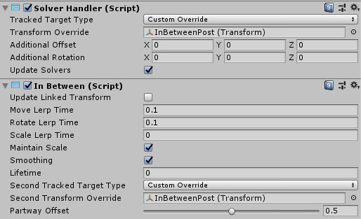

# Solver


Solvers are components that faciliate the means of calculating an object's position & orientation according to a predefine algorithm. An example may be placing an object at whatever surface the use's gaze raycast currently hits.  

Furthermore, the Solver system determinaticaly defines an order of operations for these transform calculations since there is no reliable way to specify the update order for Unity components. 

Solvers offer a range of behaviors to attach objects to other objects or systems. One other example would be a tag-along object that hovers in front of the user (based on the camera). A solver could also be attached to a controller and an object to make the object tag-along the controller. All solvers can be safely stacked, for example a tag-along behavior + surface magnetism + momentum.

## How to use a solver

The Solver system consists of three categories of scripts:

* [`Solver`](xref:Microsoft.MixedReality.Toolkit.Utilities.Solvers.Solver): The base abstract class that all solvers derive from. It provides state tracking, smoothing parameters and implementation, automatic solver system integration, and update order.
* [`SolverHandler`](xref:Microsoft.MixedReality.Toolkit.Utilities.Solvers.SolverHandler): Sets the reference object to track against (ex: the main camera transform, hand ray, etc.), handles gathering of solver components, and executes updating them in the proper order.

The third category is the solver itself. The following solvers provide the building blocks for basic behavior:

* [`Orbital`](xref:Microsoft.MixedReality.Toolkit.Utilities.Solvers.Orbital): Locks to a specified position and offset from the referenced object.
* [`ConstantViewSize`](xref:Microsoft.MixedReality.Toolkit.Utilities.Solvers.ConstantViewSize): Scales to maintain a constant size relative to the view of the referenced object.
* [`RadialView`](xref:Microsoft.MixedReality.Toolkit.Utilities.Solvers.RadialView): Keeps the object within a view cone cast by the referenced object.
* [`SurfaceMagnetism`](xref:Microsoft.MixedReality.Toolkit.Utilities.Solvers.SurfaceMagnetism): casts rays to surfaces in the world, and align the object to that surface.
* [`Momentum`](xref:Microsoft.MixedReality.Toolkit.Utilities.Solvers.Momentum): Applies acceleration/velocity/friction to simulate momentum and springiness for an object being moved by other solvers/components.
* [`InBetween`](xref:Microsoft.MixedReality.Toolkit.Utilities.Solvers.InBetween): Keeps an object in between two tracked objects.

In order to use the Solver system, simply add one of the components listed above to a GameObject. Since all Solvers require a [`SolverHandler`](xref:Microsoft.MixedReality.Toolkit.Utilities.Solvers.SolverHandler), one will be created automatically by Unity. 

## How to change tracking reference

The `TrackedTargetType` of the [`SolverHandler`](xref:Microsoft.MixedReality.Toolkit.Utilities.Solvers.SolverHandler) component defines the point of reference all solvers will use to calculate their algorithms. For example, a value type of `Head` (xref:Microsoft.MixedReality.Toolkit.Utilities.TrackedObjectType.Head) with a simple [`SurfaceMagnetism`](xref:Microsoft.MixedReality.Toolkit.Utilities.Solvers.SurfaceMagnetism) component will result in a raycast from the head and in the direction of the user's gaze for solving what surface is hit. Potential values for the `TrackedTargetType` property are:

- *Head* : Point of reference from the camera
- *MotionController*: Point of reference from motion controller. Use `TrackedHandedness` property to define details
- *HandJoint*: Point of reference from hand. Use `TrackedHandJoint` and `TrackedHandedness` properties to define details
- *CustomOverride*: Point of reference from assigned `TransformOverride`

> [!NOTE]
> For both *MotionController* and *HandJoint*, the solver handler will attempt to provide the left controller/hand transform first and then the right if the former is not available or unless the `TrackedHandedness` property specifies otherwise.


## How to use chain solvers

When *UpdateLinkedTransform* is true, the solver will calculate position & orientation, but will not apply it. This lets other components use the transform values.

## How to use the InBetween

The [`InBetween`](xref:Microsoft.MixedReality.Toolkit.Utilities.Solvers.InBetween) will keep the attached GameObject between two transforms. These two transform endpoints are defined by the GameObject's own [`SolverHandler`](xref:Microsoft.MixedReality.Toolkit.Utilities.Solvers.SolverHandler) *Tracked Target Type* and the [`InBetween`](xref:Microsoft.MixedReality.Toolkit.Utilities.Solvers.InBetween) component's *Second Tracked Target Type*. Generally, both types will be set to `CustomOverride` and the resulting `SolverHandler.TransformOverride` and `InBetween.SecondTransformOverride` transform values used as the two tracked endpoints. 

The `PartwayOffset` defines where along the line between two transforms the object shall be placed with 0.5 as halfway, 1.0 at the first transform, and 0.0 at the second transform.



## Common misteps

### SurfaceMagnetism

When adding a [`SurfaceMagnetism`](xref:Microsoft.MixedReality.Toolkit.Utilities.Solvers.SurfaceMagnetism) component to a GameObject, it is important to consider the layer of the GameObject and it's children, if any have colliders. The component works by performing various types of raycast to determine what surface to "magnet" itself against. If the GameObject has a collider on one of the layers listed in the `MagneticSurfaces` property of SurfaceMagnetism, then the raycast will likely hit itself resulting in the GameObject attaching to it's own collider point. This odd behavior can be avoided by setting the main GameObject and all children to the *Ignore Raycast* layer or modifying the `MagneticSurfaces` LayerMask array appropriately. 

Conversely, a [`SurfaceMagnetism`](xref:Microsoft.MixedReality.Toolkit.Utilities.Solvers.SurfaceMagnetism) GameObject will not collide with surfaces on a layer not listed in the `MagneticSurfaces` property. It is generally recommended to place all desired surfaces on a dedicated layer (i.e *Surfaces*) and setting the `MagneticSurfaces` property to just this layer.  Using *default* or *everything* may result in UI components or cursors contributing to the solver. 

Finally, surfaces farther than the `MaxRaycastDistance` property setting will be ignored by the Surface Magnetism raycasts. 


*Example of using Orbital solver in the [Slate](README_Slate.md) prefab.*

## Create a new Solver

All solvers must inherit from the abstract base class, [`Solver`](xref:Microsoft.MixedReality.Toolkit.Utilities.Solvers.Solver). The primary requirements of a Solver extension involes overriding `SolverUpdate` and in this method updating the inerhited `GoalPosition`, `GoalRotation` and `GoalScale` properties to the desired values. Furthermore, it is generally valuable to leverage `SolverHandler.TransformTarget` as the frame of reference desired by the consumer. 

The code provided below gives an example of a new Solver component called `InFront` that places the attached object 2m in front of the `SolverHandler.TransformTarget`. If the `SolverHandler.TrackedTargetType` is set by the consumer as `Head`, then the `SolverHandler.TransformTarget` will be the camera transform and thus this Solver will place the attached GameObject 2m in front of the users' gaze every frame.

```csharp
/// <summary>
/// InFront solver positions an object 2m in front of the tracked transform target
/// </summary>
public class InFront : Solver
{
    ...

    public override void SolverUpdate()
    {
        if (SolverHandler != null && SolverHandler.TransformTarget != null)
        {
            var target = SolverHandler.TransformTarget;
            GoalPosition = target.position + target.forward * 2.0f;
        }
    }
}
```
