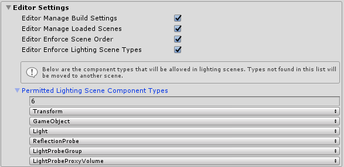

# Scene system overview

## When to use the scene system

If your project consists of a single scene, the Scene System probably isn't necessary. It is most useful when one or more of the following are true:

- Your project has multiple scenes.
- You're used to single scene loading, but you don't like the way it destroys the MixedRealityToolkit instance.
- You want a simple way to additively load multiple scenes to construct your experience.
- You want a simple way to keep track of load operations in progress or a simple way to control scene activation for multiple scenes being loaded at once.
- You want to keep lighting consistent and predictable across all your scenes.

## How to use the scene system

- [Scene Types](SceneSystemSceneTypes.md)
- [Content Scene Loading](SceneSystemContentLoading.md)
- [Monitoring Content Loading](SceneSystemLoadProgress.md)
- [Lighting Scene Loading](SceneSystemLightingScenes.md)

# Editor settings

By default, the Scene System enforces several behaviors in the Unity editor. If you find any of these behaviors heavy-handed, they can be disabled in the **Editor Settings** section of your Scene System profile.

- `Editor Manage Build Settings:` If true, the service will update your build settings automatically, ensuring that all manager, lighting and content scenes are added. Disable this if you want total control over build settings.

- `Editor Enforce Scene Order:` If true, the service will ensure that the manager scene is displayed first in scene hierarchy, followed by lighting and then content. Disable this if you want total control over scene hierarchy.

- `Editor Manage Loaded Scenes:` If true, the service will ensure that the manager, content and lighting scenes are always loaded. Disable if you want total control over which scenes are loaded in editor.

- `Editor Enforce Lighting Scene Types:` If true, the service will ensure that only the lighting-related components defined in `PermittedLightingSceneComponentTypes` are allowed in lighting scenes. Disable if you want total control over the content of lighting scenes.

