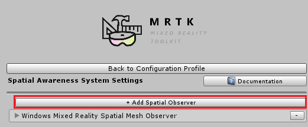
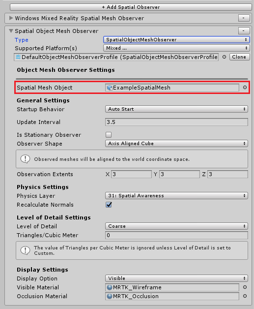

# The Spatial Object Mesh Observer

The spatial object mesh observer is an editor-only data provider for the Spatial Awareness system 
that enables using an imported 3D model to represent the spatial mesh. One common use of the 
spatial object mesh observer is to use data scanned via a Microsoft HoloLens to test how an
experience adapts to different environments from within Unity.

## Getting started

To enable the spatial object mesh observer, you will need to configure the spatial awareness system.

1. Add a new spatial observer

> {!NOTE]
> For more details on configuring profiles, please see the [Mixed Reality Toolkit Profile configuration guide](../MixedRealityConfigurationGuide.md) 

2. Select the SpatialObjectMeshObserver 

3. Select the desired Spatial Mesh Object  

By default, the observer is configured with an example model. This model was created using a Microsoft HoloLens.

## Acquiring environment scans

### Windows Device Portal

The [Windows Device Portal](https://docs.microsoft.com/en-us/windows/mixed-reality/using-the-windows-device-portal) can be used to download the spatial mesh, as a .obj file, from a Microsoft HoloLens device.

1. Scan your environment
1. Connect to your HoloLens using the Windows Device Portal
1. Navigate to the 3D View page
1. Update the Surface reconstruction
1. Save the file to your PC

### HoloToolkit .room files

Many developers will have previously used HoloToolkit to scan environments and create .room files. The 
Mixed Reality Toolkit now supports importing these files as GameObjects in Unity and use them as
Spatial Mesh Objects in the observer.

## Observer behavior notes

Since the spatial object mesh observer loads data from a 3D model, it does not honor some of the standard mesh
observer settings. The following sections describe these settings.

### Update Interval

The spatial object mesh observer sends all meshes to an application when the model is loaded. It does not
simulate time deltas between updates.

An application can re-receive the mesh events by calling ClearObservations() and the Resume(). 

### Is Stationary Observer

The spatial observer considers all 3D mesh objects to be stationary.

### Observer Shape and Extents

The spatial object meshobserver sends the entire 3D mesh to the application. Observer shape and extents are not considered.

## Level of Detail and Triangles / Cubic Meter

The observer does not attempt to find 3D model LODs when sending the meshes to the application. 

## See also

- [Profiles](../Profiles/Profiles.md)
- [Mixed Reality Toolkit Profile configuration guide](../MixedRealityConfigurationGuide.md) 
- [Spatial Awareness](SpatialAwarenessGettingStarted.md)
- [Configuring the Spatial Awareness Mesh Observer](ConfiguringSpatialAwarenessMeshObserver.md)
- [Using the Windows Device Portal](https://docs.microsoft.com/en-us/windows/mixed-reality/using-the-windows-device-portal)

